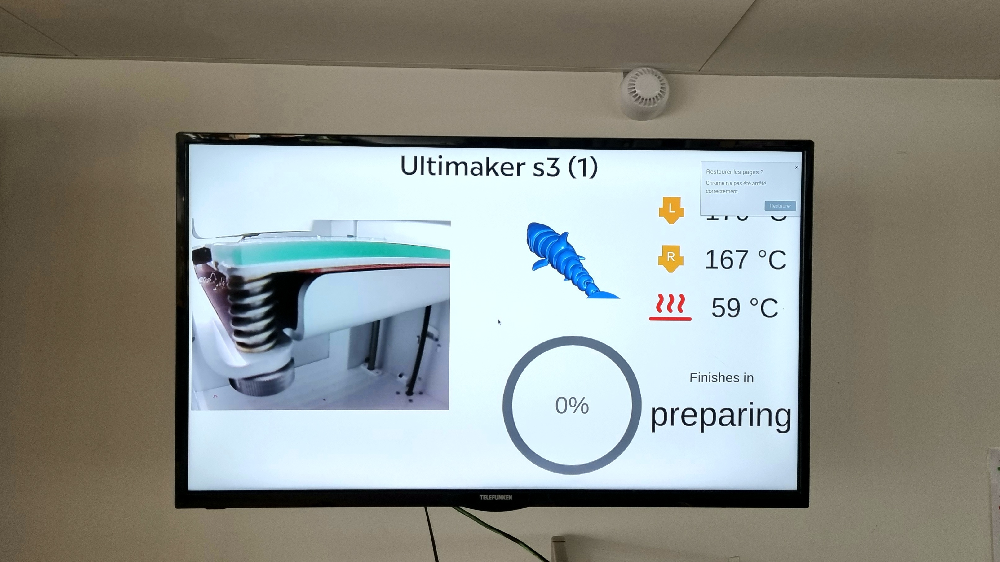
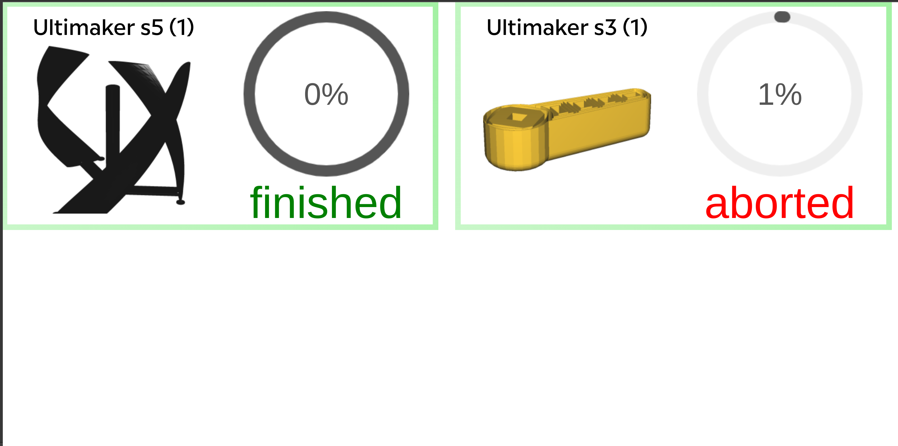
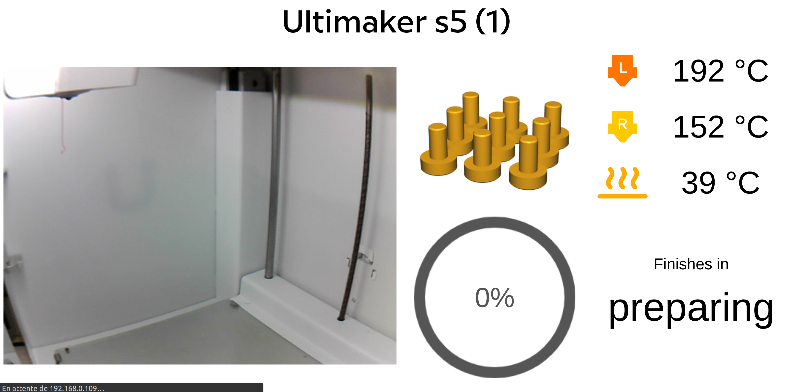
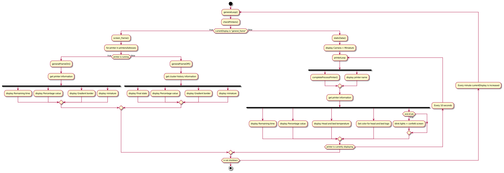

# Application de suivi – Ultimaker série S

Depuis Septembre 2021, Eirlab Community possède 2 imprimantes Ultimaker de série S. Ces imprimantes sont livrées avec
une API développée par Ultimaker permettant d'obtenir les différentes informations sur les impressions, l'état de l'
imprimante etc.

En conséquence, Antoine et Sébastien ont développé une application permettant de suivre les impressions en cours à
Eirlab, cette application est sous license GPL3.0 sur ce dépôt et est développé en Javascript permettant de l'afficher
sur un navigateur.

L'application est actuellement utilisée sur une des télévisions d'Eirlab nous permettant de voir l'état des imprimantes
depuis l'open space.

des imprimantes 3D sont statiques sur le réseau des objets connectés d'Eirlab. L'écran defile entre nos imprimantes 3D
en fonction des situations :

+ Lorsqu'une imprimante n'est en fonctionnement, un écran général affiche les dernières impressions et leur état final,
  un carré vert clignotant autour d'une imprimante indique que l'imprimante est disponible.
+ Lorsque au moins une impression est en cours l'application alterne entre l'écran général affichant le status de toutes
  les imprimantes et l'écran spécifique à chaque imprimante indiquant le temps restant, les températures et
  retransmettant les images de la caméra intégrée à l'imprimante

Concernant le code des modèles HTML ont été mis en place par Antoine, notre code JavaScript se contente de modifier
certains passages de ce HTML avec les données qu'il récupère au près de l'API selon le diagramme d'activité suivant

## Contribution

+ ✨ Les nouvelles fonctionnalités et des idées de fonctionnalités de cet écran sont les bienvenues ! ⚠️ L'accès à l'API des imprimantes 3D ne peut se faire que via le réseau eirlabIoT.
+ 🐛 Notre première implémentation contient encore beaucoup d'erreurs dans la console, il serait bien de passer du temps pour les corriger ...
+ ♻️ Notre code à besoin d'un refactor pour organiser les différentes fonctions dans des classes et faire interagir les classes entre elles